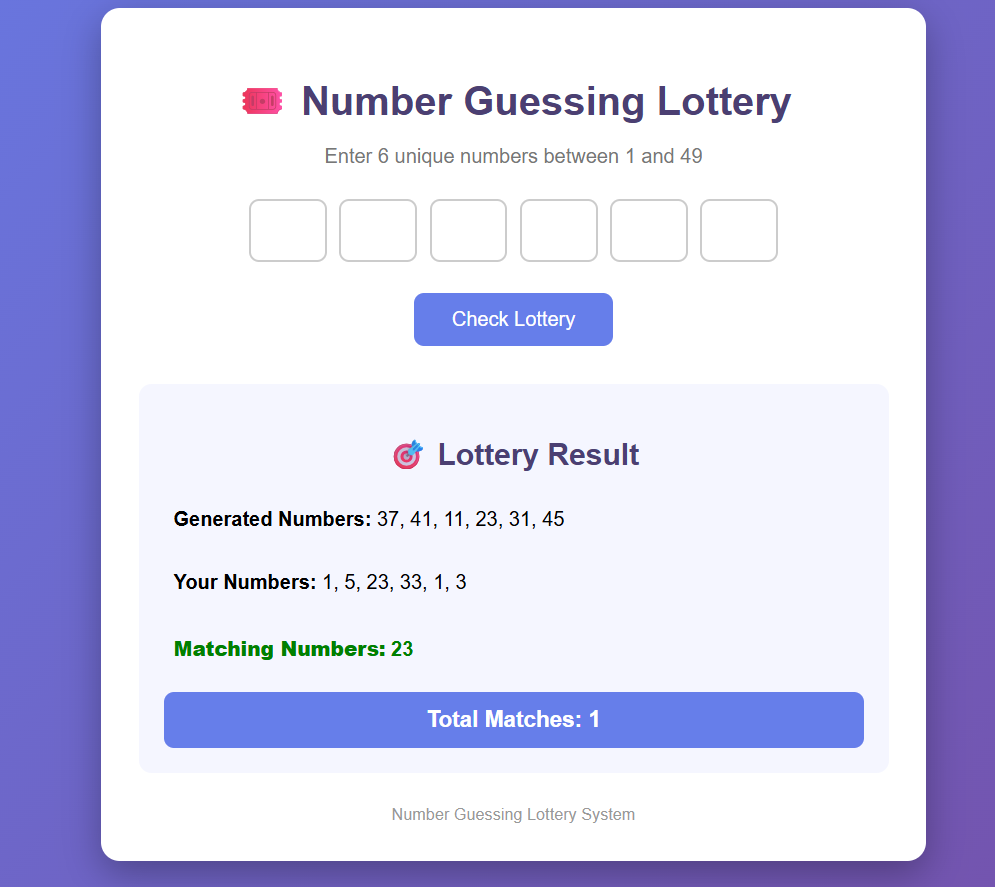

# 🎟️ Number Guessing Lottery

## Student Details

* Roll Number: 997
* Name - Nanita
* Project Name: Number Guessing Lottery
* Technology: HTML, CSS, PHP

## Project Objective

The objective of this mini-project is to develop a simple Number Guessing Lottery system using PHP. The system generates 6 unique random lottery numbers between 1 and 49. The user enters 6 numbers, and the system compares the user's numbers with the generated lottery numbers. It then displays the matching numbers and the total number of matches.

## Features

* Generates 6 unique random lottery numbers
* Lottery numbers are generated between 1 and 49
* Allows the user to enter 6 numbers
* Checks the entered numbers
* Finds matching numbers automatically
* Displays the generated lottery numbers
* Displays the user's entered numbers
* Displays matching numbers
* Displays total number of matches
* Simple and attractive web interface
* Responsive CSS design
* No database required

## Algorithm / Flowchart

### Algorithm

1. Start the application.
2. Generate 6 unique random numbers between 1 and 49.
3. Display an HTML form for entering 6 numbers.
4. Accept the numbers entered by the user.
5. Compare the user's numbers with the generated lottery numbers.
6. Find the matching numbers using PHP array functions.
7. Count the total matching numbers.
8. Display the generated lottery numbers.
9. Display the user's numbers and matching numbers.
10. Display the total number of matches.
11. Stop.

### Flowchart

```text
START
   |
   v
Generate 6 Unique Lottery Numbers
   |
   v
Display Lottery Form
   |
   v
User Enters 6 Numbers
   |
   v
Submit Form
   |
   v
Compare User Numbers
with Lottery Numbers
   |
   v
Find Matching Numbers
   |
   v
Count Total Matches
   |
   v
Display Lottery Result
   |
   v
   END
```

## Technologies Used

* HTML5
* CSS3
* PHP
* PHP Arrays
* HTML Forms

## PHP Concepts Used

* Variables
* Arrays
* `while` loop
* `if` condition
* `rand()` function
* `in_array()` function
* `array_intersect()` function
* `count()` function
* `implode()` function
* Form handling using `POST`

## Project Files

```text
Number-Guessing-Lottery/
├── lottery.php
└── README.md
```

## Steps to Run

### Using XAMPP

1. Install and open XAMPP.
2. Start **Apache**.
3. Copy the `Number-Guessing-Lottery` folder into:

```text
C:\xampp\htdocs\
```

4. Open a web browser.
5. Visit:

```text
http://localhost/Number-Guessing-Lottery/lottery.php
```

6. Enter 6 unique numbers between 1 and 49.
7. Click **Check Lottery**.
8. The lottery result will be displayed.

## Output

The application displays:

* Generated Lottery Numbers
* User Entered Numbers
* Matching Numbers
* Total Number of Matches


### Example

```text
Generated Numbers:
5, 8, 12, 19, 31, 45

Your Numbers:
5, 12, 18, 25, 31, 40

Matching Numbers:
5, 12, 31

Total Matches:
3
```

## Purpose

This project is created for learning basic PHP programming concepts, including arrays, loops, conditional statements, random number generation, form handling, and array functions.

## GitHub Repository Name

`Number-Guessing-Lottery`

## Author

**Nanita**

## About

Number Guessing Lottery - Simple PHP Mini Project
